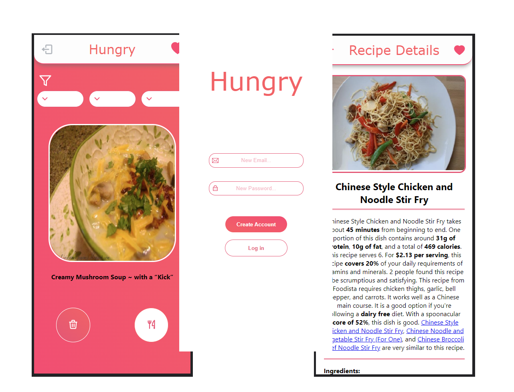

# Hungry

Author: Tornike Jimshiashvili

Are you indecisive when it comes to choosing what to eat?

Introducing Hungry, an app designed to help you with this indecision. This app was designed to help users find random recipes to which they can choose from. Using similar UI as Tinder, its very user friendly, just having two buttons to like or dislike the recipe rendered on screen. The user can also use filters to look for certain cuisines, meal types or diets. Once a user likes a dish, it gets sent to the liked list. Here you will have the option to either favorite or delete the recipe. The user can also click on the recipe picture, directing them to the recipe details page, where they will will find a brief summary, ingredients and preparation guide. Lastly the user can leave their notes at the bottom of the details page.

## Screenshots



## Getting started

1. Clone the repo

   ```
   git clone https://github.com/tornikej98/Hungry.git

   cd Verve
   ```

2. Install required dependencies

   ```
   cd /client

   npm i
   ```

   ```
   cd /Server

   npm i
   ```

3. Start the server

   ```
   cd /Server

   node ./index.js
   ```

4. Start the client

   ```
   cd /client

   npm start
   ```

### **_Run the app at 390 x 844 px_**


## Using the app

### Registration page

Choose an unique email and password to create an account

### Main page

As the page loads up you will see a picture of a random recipe as well as its name.
The user can press the garbage button to discard the recipe and fetch a new one,
or like the recipe using the fork & knife button to save it to the liked list and
fetch the next recipe

The use is also able to use the filters to fetch recipes based on cuisine, meal type or diet.

### Liked recipes

To access the liked recipes page, just click on the heart icon located at the top right. This will show the list of all liked recipes. The user may favorite or delete the recipes by clicking on the corresponding icons. The user can also click on the recipe image to be re-directed to the recipe information.

### Recipe info

The recipe info displays important information for the user such as: recipe summary, its score, ingredients and instructions.

The user may also leave a custom note for the recipe if they feel that the recipe needed some modification. Aditionally, they can access the link to be directed to the original link of the recipe.

# Tech Stack

- Database: [Mongoose](https://mongoosejs.com/) with [MongoDB](https://www.mongodb.com/)
- Back end: [Node js](https://nodejs.org/en) & [Express](https://expressjs.com/)

- Authentication: [JWT](https://jwt.io/)
- Front end: [React](https://react.dev/)
- Styling: CSS
